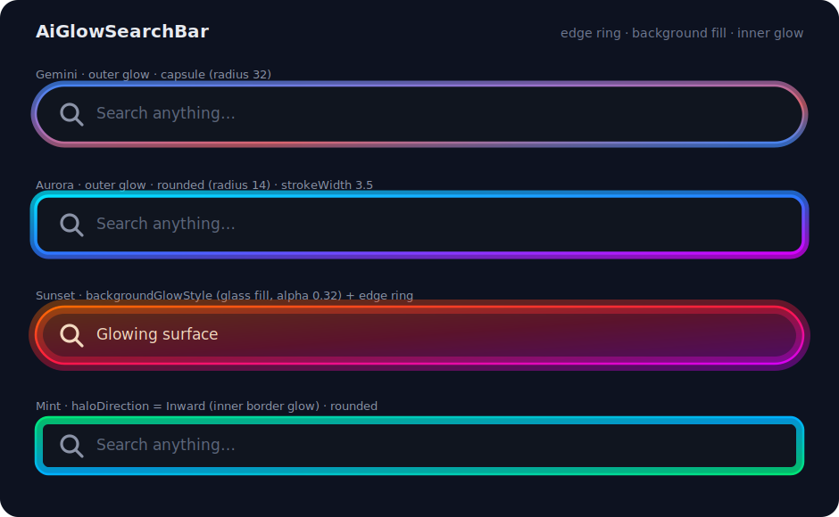
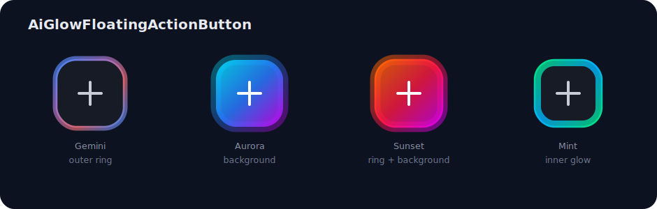
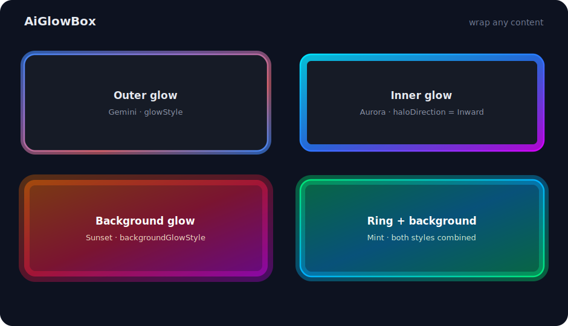

# AiGlow

<p align="center">
  <a href="https://jitpack.io/#Sangyoon98/AiGlowSearchBar"></a>
  
  
  
  <a href="https://opensource.org/licenses/MIT"></a>
</p>

<p align="center">
  <a href="README.md">English</a> | <b>한국어</b>
</p>

<p align="center">
  
</p>

UI를 회전하는 AI 스타일 그라디언트 글로우로 감싸는 순수 Jetpack Compose 라이브러리입니다. 콘텐츠 뒤에는 부드럽게 번지는 halo를, 가장자리에는 선명한 sweep-gradient 링을 그립니다.

- **전역 상태 제로** — 모든 글로우 컴포넌트는 구조적으로 독립 애니메이션됩니다.
- **애니메이션 중 recomposition 제로** — 회전 각도는 draw phase에서만 읽습니다.
- **지원하는 모든 API 레벨(26+)에서 동작** — 블러 halo 포함.
- **Activity / Application Context 의존 없음** — 어떤 Compose 모듈에서도 안전합니다.

## 컴포넌트

| 컴포넌트 | 설명 |
|---|---|
| `AiGlowSearchBar` | Material 3 `OutlinedTextField` 기반 검색 바. 포커스/눌림에 글로우가 반응하며 placeholder, 좌우 슬롯(아이콘 또는 임의 컴포저블), IME 검색 액션, 활성/읽기전용 상태를 지원합니다. |
| `AiGlowFloatingActionButton` | 누르는 동안 밝아지는 글로우를 두른 Material 3 FAB. |
| `AiGlowBox` | *어떤* 콘텐츠든 글로우로 감싸는 범용 컨테이너. 클릭(ripple 포함)도 선택적으로 지원합니다. |
| `Modifier.aiGlow(...)` | 위 컴포넌트들이 공유하는 테두리 링 Modifier — 원하는 컴포저블에 직접 테두리 글로우를 붙일 수 있습니다. |
| `Modifier.aiGlowBackground(...)` | 표면 버전: 컴포넌트 자체를 회전 그라디언트로 채우고 바깥으로 번지게(bloom) 합니다. |

모든 컴포넌트는 독립적인 스타일 파라미터 두 개를 받습니다 — `glowStyle`(테두리 링)과 `backgroundGlowStyle`(표면 채움). 각각 색/투명도/회전 속도를 따로 가지며, 단독으로도 함께도 쓸 수 있습니다.

## 미리보기

각 컴포넌트는 여러 스타일 조합을 지원합니다 — 테두리 링 글로우, 배경 표면 채움, 안쪽(inward) 글로우 — 모두 `GlowConfig` / `AiGlowStyle`로 커스터마이징할 수 있습니다.

**`AiGlowSearchBar`**

<p align="center"></p>

**`AiGlowFloatingActionButton`**

<p align="center"></p>

**`AiGlowBox`**

<p align="center"></p>

> 대표적인 설정을 나타낸 예시 렌더링입니다. 모든 파라미터를 조절할 수 있는 실제 애니메이션 버전은 `:app` 플레이그라운드에서 실행해 확인하세요.

## 설치

### 소스에서 (개발용)

라이브러리는 `:aiglow` Gradle 모듈에 있습니다. 이 저장소를 클론한 뒤:

```kotlin
// settings.gradle.kts
include(":aiglow")

// 사용하는 모듈의 build.gradle.kts
dependencies {
    implementation(project(":aiglow"))
}
```

### JitPack에서 (배포된 릴리스)

```kotlin
// settings.gradle.kts 또는 루트 build.gradle.kts
repositories {
    maven { url 'https://jitpack.io' }
}

// 사용하는 모듈의 build.gradle.kts
dependencies {
    implementation 'com.github.Sangyoon98.AiGlowSearchBar:aiglow:v1.2.1'
}
```

> 좌표 형식 참고: 이 저장소는 Gradle 모듈이 여러 개(`:app`, `:aiglow`)이므로, JitPack은 단일 모듈용 `com.github.<user>:<repo>:<tag>` 대신 `com.github.<user>.<repo>:<module>:<tag>` 형식(user/repo를 점으로 연결)을 요구합니다. `v1.2.1`은 원하는 릴리스 태그로 바꾸세요.

> **배포 절차:** [PUBLISHING.md](PUBLISHING.md) 참조.

**요구 사항:** minSdk 26, Kotlin 2.2+, Jetpack Compose (BOM 2026.02+), Material 3.

## 빠른 시작

```kotlin
var query by rememberSaveable { mutableStateOf("") }

AiGlowSearchBar(
    query = query,
    onQueryChange = { query = it },
    modifier = Modifier.fillMaxWidth(),
    placeholder = { Text("무엇이든 검색…") },
    onSearch = { runSearch(it) },
)
```

FAB과 글로우 카드:

```kotlin
AiGlowFloatingActionButton(onClick = { /* … */ }) {
    Icon(Icons.Default.Add, contentDescription = "추가")
}

AiGlowBox(
    modifier = Modifier.size(200.dp, 96.dp),
    onClick = { /* … */ },
    backgroundColor = MaterialTheme.colorScheme.surfaceVariant,
    contentAlignment = Alignment.Center,
) {
    Text("아무 콘텐츠나")
}
```

원본 Modifier로 무엇이든 빛나게:

```kotlin
Card(modifier = Modifier.aiGlow(GlowConfig(shape = RoundedCornerShape(12.dp)))) { /* … */ }
```

## 커스터마이징

모든 것은 불변 `GlowConfig`가 결정합니다 — `copy()`로 커스터마이징하세요:

```kotlin
val config = GlowConfig(
    colors = AiGlowDefaults.AuroraColors,       // 링 그라디언트 색
    strokeWidth = 3.dp,                          // 링 두께
    blurRadius = 24.dp,                          // halo 번짐 (0.dp = halo 없음)
    rotationDuration = 1_500,                    // 한 바퀴(360°) 시간(ms)
    shape = RoundedCornerShape(20.dp),           // 0.dp = 사각형 … 28.dp+ = 캡슐
    haloColors = listOf(Color.Cyan, Color.Blue), // 별도 "셰도우" 팔레트 (선택)
    haloStrokeWidth = 8.dp,                      // halo 두께 (기본 strokeWidth * 2)
    alpha = 0.9f,                                // 글로우 전체 불투명도
    animated = true,                             // false = 정지된 그라디언트
    easing = LinearEasing,                       // 회전 easing
)
```

| 파라미터 | 타입 | 기본값 | 의미 |
|---|---|---|---|
| `colors` | `List<Color>` | `AiGlowDefaults.GeminiColors` | 링의 sweep 그라디언트 색 |
| `strokeWidth` | `Dp` | `2.dp` | 링 두께 |
| `blurRadius` | `Dp` | `16.dp` | halo 번짐 반경. `0.dp`면 halo 없음 |
| `rotationDuration` | `Int` (ms) | `4000` | 한 바퀴 도는 시간 |
| `shape` | `Shape` | `RoundedCornerShape(28.dp)` | 글로우와 호스트 컴포넌트가 **공유**하는 외곽선 — 임의 radius, 커스텀 `Shape` 모두 가능 |
| `haloColors` | `List<Color>?` | `null` (= `colors`) | halo/셰도우 전용 팔레트 |
| `haloStrokeWidth` | `Dp?` | `null` (= `strokeWidth * 2`) | halo 링 두께 |
| `alpha` | `Float` | `1f` | 글로우 전체 불투명도 |
| `animated` | `Boolean` | `true` | 회전 on/off |
| `easing` | `Easing` | `LinearEasing` | 회전 easing 곡선 |
| `haloDirection` | `HaloDirection` | `Outward` | 링 halo가 번지는 방향: `Outward`, `Inward`(안쪽 글로우, 콘텐츠 위에 그려짐), `Both`. 링 전용 — 배경 글로우에서는 무시됨 |

### 안쪽 테두리 글로우

`haloDirection = HaloDirection.Inward`로 설정하면 링의 halo가 바깥이 아니라 컴포넌트 *안쪽*으로 번집니다 — 테두리에서 빛이 스며드는 효과입니다. `Both`는 양방향 대칭으로 번집니다. 안쪽 절반은 콘텐츠 위에 그려지므로 불투명 컨테이너 위에서도 보입니다. 컴포넌트에 새 파라미터가 필요 없는 config 필드라서 상태별 스타일링도 평소처럼 동작합니다:

```kotlin
AiGlowSearchBar(
    query = query,
    onQueryChange = { query = it },
    glowStyle = AiGlowDefaults.interactiveStyle(
        GlowConfig(haloDirection = HaloDirection.Inward),
    ),
)
```

기본 제공 팔레트: `AiGlowDefaults.GeminiColors`, `AuroraColors`, `SunsetColors`, `MintColors`.

## 인터랙션 상태

`AiGlowStyle`은 인터랙션 상태마다 `GlowConfig`를 하나씩 담습니다. 지정하지 않은 상태는 `idle`로 폴백하며, 우선순위는 `disabled > pressed > focused > hovered > idle`입니다.

```kotlin
// 기본 제공 스타일: idle은 은은하게, 포커스/눌림엔 환하게.
val style = AiGlowDefaults.interactiveStyle(GlowConfig(colors = AiGlowDefaults.SunsetColors))

// 또는 완전 수동 제어:
val custom = AiGlowStyle(
    idle = GlowConfig(alpha = 0.5f),
    focused = GlowConfig(alpha = 1f, rotationDuration = 2_000),
    pressed = GlowConfig(colors = AiGlowDefaults.MintColors),
    disabled = GlowConfig(alpha = 0.2f, animated = false), // 생략 시 → 흐려지고 정지된 idle 자동 파생
)

AiGlowSearchBar(query, onQueryChange, glowStyle = custom)
```

상태 간 alpha 차이는 부드럽게 애니메이션되고, 구조적 변화(색/두께/모양)는 상태 경계에서 전환됩니다.

## 배경 글로우 (표면 채움)

테두리 링과 별개로 컴포넌트의 *표면 자체*가 빛날 수 있습니다: `backgroundGlowStyle`은 shape 내부를 회전하는 sweep 그라디언트로 채우고, `blurRadius > 0`이면 가장자리 밖으로 번집니다(bloom). 링과 완전히 독립적이라 전용 팔레트·투명도·회전 속도·easing을 가지며, 둘을 동시에 켤 수도 있습니다:

```kotlin
AiGlowSearchBar(
    query = query,
    onQueryChange = { query = it },
    glowStyle = AiGlowDefaults.interactiveStyle(),               // 테두리 링 (null이면 없음)
    backgroundGlowStyle = AiGlowDefaults.interactiveStyle(
        GlowConfig(
            colors = AiGlowDefaults.AuroraColors,
            alpha = 0.35f,            // 텍스트 가독성을 위해 표면은 반투명 권장
            blurRadius = 20.dp,       // 바깥 번짐 (0.dp = 선명한 채움)
            rotationDuration = 6_000, // 링 속도와 독립
        ),
    ),
)
```

원본 Modifier로 아무 컴포저블의 표면이나 빛나게 할 수도 있습니다: `Modifier.aiGlowBackground(config)` — `aiGlow` 뒤에 체이닝하면 함께 렌더링됩니다(`Modifier.aiGlow(ring).aiGlowBackground(fill)`).

fill 모드에서의 `GlowConfig` 필드 의미: `colors` = 표면 그라디언트, `alpha` = 표면 불투명도, `blurRadius` = bloom 거리, `haloColors` = bloom 팔레트 재정의. `strokeWidth`/`haloStrokeWidth`/`haloDirection`은 사용되지 않습니다(채움의 bloom은 항상 바깥 방향). 채움은 콘텐츠 *뒤*에 그려지므로 호스트 컨테이너가 투명해야 하는데, 제공되는 컴포넌트들은 `backgroundGlowStyle` 지정 시 자동으로 투명 기본값으로 전환됩니다(FAB은 elevation 그림자도 제거).

## 동작 원리 (그리고 빠른 이유)

- **`GlowConfig`는 `@Immutable` data class** — 동일한 config가 전달되는 한 recomposition을 건너뛸 수 있게 하는 stability 계약입니다 ([Compose stability 가이드](https://developer.android.com/develop/ui/compose/performance/stability)).
- **회전 상태는 호출 지점별 composition에 격리** (`rememberInfiniteTransition`) — 글로우 컴포넌트를 몇 개를 배치해도 서로 간섭할 수 없습니다. 전역/`companion object` 상태가 어디에도 없습니다.
- **각도는 draw phase에서만 읽으므로** 애니메이션은 *그리기만* 무효화합니다: 60~120fps 내내 composition/layout 0회 ([Compose phases](https://developer.android.com/develop/ui/compose/phases), [읽기 지연](https://developer.android.com/develop/ui/compose/performance/bestpractices)).
- **비싼 객체(외곽선 Path, 셰이더, Paint)는 `drawWithCache`로 캐시**되어 크기/설정이 바뀔 때만 재생성됩니다 ([graphics modifiers](https://developer.android.com/develop/ui/compose/graphics/draw/modifiers)).
- **그라디언트는 캔버스가 아닌 셰이더의 local matrix로 회전** — 모양은 기울지 않고 색만 흐릅니다.
- **halo는 `Modifier.blur()`가 아닌 `BlurMaskFilter` 사용** — `Modifier.blur()`는 콘텐츠까지 흐리게 하고 API 31 미만에서 무시됩니다. 마스크 필터는 글로우 스트로크만 흐리며 API 28부터 하드웨어 가속되고, API 26~27에서는 다층 스트로크 근사로 그려 `blurRadius`가 모든 기기에서 동작합니다.

## 데모 앱 — 인터랙티브 플레이그라운드

`:app` 모듈에는 모든 커스터마이징 옵션을 실시간으로 조작할 수 있는 플레이그라운드가 들어 있습니다:

- 컴포넌트 전환(Search Bar / FAB / Box)과 컴포넌트별 토글(아이콘, 지우기 버튼, 배경)
- 링 팔레트 프리셋 + 순서 있는 커스텀 팔레트 빌더(견본을 탭하면 숫자로 그라디언트 순서 표시)
- 링 두께, halo 두께, blur radius, corner radius(사각형 ↔ 캡슐), 회전 속도, alpha 슬라이더
- halo 색 분리, halo 방향(바깥/안쪽/양방향), 애니메이션 on/off, easing 선택
- 활성/비활성, 상태 반응 스타일 토글
- 인스턴스 간 애니메이션 독립성을 확인하는 "트윈 프리뷰"(0.5× 주기)
- 현재 설정을 복사 가능한 Kotlin 코드로 보여주는 **Generated code** 블록

Android Studio에서 실행하세요.

## 기여하기

기여를 환영합니다 — 브랜치/PR 워크플로와 커밋 컨벤션은 [CONTRIBUTING.md](CONTRIBUTING.md)를 참고하세요. 프로젝트 맥락과 아키텍처 규칙은 — 사람과 AI 코딩 에이전트(Claude Code, Codex 등) 모두를 위해 — [AGENTS.md](AGENTS.md)에 정리되어 있습니다. 수정 전에 먼저 읽어주세요.

## 라이선스

```
MIT License

Copyright (c) 2026 Sangyoon
```

전체 내용은 [LICENSE](LICENSE) 파일을 참고하세요.
