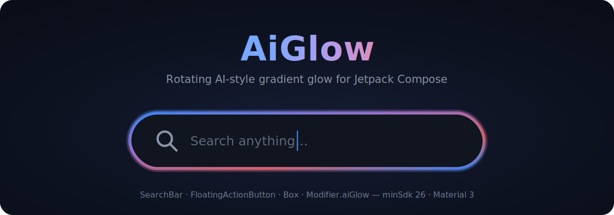

# AiGlow

**English** | [한국어](README.ko.md)

<p align="center">
  
</p>

A pure Jetpack Compose library that wraps your UI in a rotating, AI-style gradient glow — a soft blurred halo behind the content plus a crisp sweep-gradient ring around its edge.

- **Zero global state** — every glowing component animates independently by construction.
- **Zero recomposition while animating** — the rotation is read only in the draw phase.
- **Works on every supported API level (26+)** — including the blur halo.
- **No Activity / Application Context dependency** — safe to use from any Compose module.

## Components

| Component | Description |
|---|---|
| `AiGlowSearchBar` | A Material 3 `OutlinedTextField`-based search bar with glow that reacts to focus/press. Slots for placeholder, leading/trailing content, IME search action, enabled/read-only states. |
| `AiGlowFloatingActionButton` | A Material 3 FAB wrapped in glow that brightens while pressed. |
| `AiGlowBox` | A general-purpose container that puts a glow around *any* content, optionally clickable (ripple included). |
| `Modifier.aiGlow(...)` | The raw modifier behind all of the above — attach a glow to any composable yourself. |

## Preview

_Screenshots from the playground app will be added here._

<!-- Capture from the :app playground, drop the files into docs/images/, then uncomment:

| Search Bar | FAB | Box |
|:---:|:---:|:---:|
|  |  |  |

<p align="center"></p>
-->

## Installation

### From source (for development)

The library lives in the `:aiglow` Gradle module. Clone this repo and add:

```kotlin
// settings.gradle.kts
include(":aiglow")

// your module's build.gradle.kts
dependencies {
    implementation(project(":aiglow"))
}
```

### From JitPack (published releases)

```kotlin
// settings.gradle.kts or root build.gradle.kts
repositories {
    maven { url 'https://jitpack.io' }
}

// your module's build.gradle.kts
dependencies {
    implementation 'com.github.YOUR_USERNAME:aiglow:v1.0.0'
}
```

Replace `YOUR_USERNAME` with the GitHub username and `v1.0.0` with the desired release tag.

> **Release flow:** see [PUBLISHING.md](PUBLISHING.md).

**Requirements:** minSdk 26, Kotlin 2.2+, Jetpack Compose (BOM 2026.02+), Material 3.

## Quick start

```kotlin
var query by rememberSaveable { mutableStateOf("") }

AiGlowSearchBar(
    query = query,
    onQueryChange = { query = it },
    modifier = Modifier.fillMaxWidth(),
    placeholder = { Text("Search anything…") },
    onSearch = { runSearch(it) },
)
```

A FAB and a glowing card:

```kotlin
AiGlowFloatingActionButton(onClick = { /* … */ }) {
    Icon(Icons.Default.Add, contentDescription = "Add")
}

AiGlowBox(
    modifier = Modifier.size(200.dp, 96.dp),
    onClick = { /* … */ },
    backgroundColor = MaterialTheme.colorScheme.surfaceVariant,
    contentAlignment = Alignment.Center,
) {
    Text("Any content")
}
```

Or glow anything with the raw modifier:

```kotlin
Card(modifier = Modifier.aiGlow(GlowConfig(shape = RoundedCornerShape(12.dp)))) { /* … */ }
```

## Customization

Everything is driven by the immutable `GlowConfig` — customize with `copy()`:

```kotlin
val config = GlowConfig(
    colors = AiGlowDefaults.AuroraColors,       // ring gradient colors
    strokeWidth = 3.dp,                          // ring thickness
    blurRadius = 24.dp,                          // halo spread (0.dp = no halo)
    rotationDuration = 1_500,                    // ms per 360° turn
    shape = RoundedCornerShape(20.dp),           // 0.dp = rectangle … 28.dp+ = capsule
    haloColors = listOf(Color.Cyan, Color.Blue), // separate "shadow" palette (optional)
    haloStrokeWidth = 8.dp,                      // halo thickness (default strokeWidth * 2)
    alpha = 0.9f,                                // overall glow opacity
    animated = true,                             // false = static gradient
    easing = LinearEasing,                       // rotation easing
)
```

| Parameter | Type | Default | Meaning |
|---|---|---|---|
| `colors` | `List<Color>` | `AiGlowDefaults.GeminiColors` | Sweep gradient colors of the ring |
| `strokeWidth` | `Dp` | `2.dp` | Ring thickness |
| `blurRadius` | `Dp` | `16.dp` | Halo spread; `0.dp` disables the halo |
| `rotationDuration` | `Int` (ms) | `4000` | Time per full rotation |
| `shape` | `Shape` | `RoundedCornerShape(28.dp)` | Outline of glow **and** host component — any radius, any custom `Shape` |
| `haloColors` | `List<Color>?` | `null` (= `colors`) | Separate halo/shadow palette |
| `haloStrokeWidth` | `Dp?` | `null` (= `strokeWidth * 2`) | Halo ring thickness |
| `alpha` | `Float` | `1f` | Overall glow opacity |
| `animated` | `Boolean` | `true` | Turn rotation on/off |
| `easing` | `Easing` | `LinearEasing` | Rotation easing curve |

Ready-made palettes: `AiGlowDefaults.GeminiColors`, `AuroraColors`, `SunsetColors`, `MintColors`.

## Interaction states

`AiGlowStyle` holds one `GlowConfig` per interaction state. Unset states fall back to `idle`; priority is `disabled > pressed > focused > hovered > idle`.

```kotlin
// Opinionated default: dim when idle, bright on focus/press.
val style = AiGlowDefaults.interactiveStyle(GlowConfig(colors = AiGlowDefaults.SunsetColors))

// Or full manual control:
val custom = AiGlowStyle(
    idle = GlowConfig(alpha = 0.5f),
    focused = GlowConfig(alpha = 1f, rotationDuration = 2_000),
    pressed = GlowConfig(colors = AiGlowDefaults.MintColors),
    disabled = GlowConfig(alpha = 0.2f, animated = false), // omit → auto-derived dim static idle
)

AiGlowSearchBar(query, onQueryChange, glowStyle = custom)
```

Alpha differences between states animate smoothly; structural changes (colors, thickness, shape) switch at the state boundary.

## How it works (and why it's fast)

- **`GlowConfig` is an `@Immutable` data class** — a stability contract that lets Compose skip recomposition when an equal config is passed ([Compose stability guide](https://developer.android.com/develop/ui/compose/performance/stability)).
- **Rotation state lives in composition, per call site** (`rememberInfiniteTransition`), so multiple glowing components can never interfere — there is no global or `companion object` state anywhere.
- **The angle is read only inside the draw phase**, so animating invalidates *drawing only*: no composition, no layout, at 60–120fps ([Compose phases](https://developer.android.com/develop/ui/compose/phases), [defer reads](https://developer.android.com/develop/ui/compose/performance/bestpractices)).
- **Expensive objects (outline path, shaders, paint) are cached with `drawWithCache`** and rebuilt only when size or config change ([graphics modifiers](https://developer.android.com/develop/ui/compose/graphics/draw/modifiers)).
- **The gradient rotates via the shader's local matrix**, not the canvas — so the shape never tilts, only the colors flow.
- **The halo uses `BlurMaskFilter`, not `Modifier.blur()`** — `Modifier.blur()` would blur your content too and is ignored below API 31. The mask filter blurs only the glow stroke and is hardware-accelerated from API 28; on API 26–27 a layered-stroke approximation is drawn instead, so `blurRadius` works everywhere.

## Demo app — interactive playground

The `:app` module ships a playground where every customization option can be tweaked live:

- Component switcher (Search Bar / FAB / Box) with per-component toggles (icons, clear button, background)
- Ring palette presets + an ordered custom-palette builder (tap swatches, numbers show gradient order)
- Sliders for stroke width, halo width, blur radius, corner radius (rectangle ↔ capsule), rotation duration and alpha
- Halo color override, animation on/off, easing selection
- Enabled/disabled and state-aware styling toggles
- A "twin preview" running at 0.5× duration to verify animation independence between instances
- A **Generated code** block that renders your current selection as copy-pastable Kotlin

Run it from Android Studio.

## Contributing

Contributions are welcome. Project context and architecture rules — for humans and AI coding agents (Claude Code, Codex, …) alike — live in [AGENTS.md](AGENTS.md). Start there before making changes.

## License

TBD.
